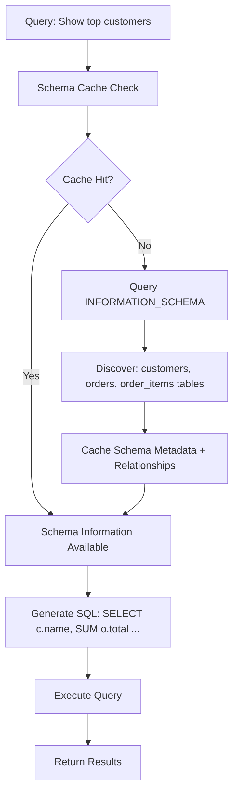

# LLM Architecture Scenarios Guide

## Abbreviations & Terms

### **LLM (Large Language Model)**
AI models trained on vast text datasets to understand and generate human language. Think of ChatGPT or Claude - they can write, analyze, code, and reason about almost any topic. Examples include Claude Sonnet/Opus, GPT-4, or Bedrock's foundation models. Used for chatbots, content generation, code assistance, and document analysis. The "large" refers to billions of parameters that enable sophisticated language understanding and generation capabilities.

### **RAG (Retrieval Augmented Generation)**  
Architecture combining LLMs with external knowledge retrieval. Instead of relying only on training data, RAG fetches relevant information from databases/documents before generating responses. Example: asking "What's our vacation policy?" → system searches company handbook → provides LLM with policy text → generates accurate, current answer. Solves LLM limitations like outdated knowledge and hallucinations by grounding responses in real data.

### **VDB (Vector Database)**
Specialized database storing mathematical representations (vectors) of text, images, or other data for similarity search. When you upload a document, it's converted into vectors that capture meaning. Example: OpenSearch storing embedded customer reviews, enabling search for "products with quality issues" by finding semantically similar vectors. Essential for RAG systems to quickly find relevant information from large document collections.

### **KB (Document Knowledge Base)**
Organized collection of documents and information that LLMs can query for contextual responses. Contains structured data like FAQs, unstructured documents like PDFs, or company wikis. Example: Bedrock Document Knowledge Base containing employee handbooks, policies, and procedures that Claude can reference when answering HR questions. Different from traditional databases - designed specifically for LLM integration with features like automatic chunking and embedding generation.

### **API (Application Programming Interface)**
Set of protocols enabling different software systems to communicate. For LLMs, APIs let your applications send queries and receive responses programmatically. Example: your chatbot sends POST request to Claude API with user question, receives JSON response with answer. Enables integration of LLM capabilities into existing applications, websites, or business systems without rebuilding from scratch.

### **AWS (Amazon Web Services)**
Cloud computing platform providing infrastructure and managed services for building scalable applications. For LLM architectures, offers services like Bedrock (managed AI), OpenSearch (vector search), S3 (document storage), and Lambda (serverless computing). Example: entire RAG system running on AWS with documents in S3, vectors in OpenSearch, and Claude accessed via Bedrock - all managed and scalable.

### **Foundation Model**
Large pre-trained AI model serving as base for various applications. Like a Swiss Army knife for AI tasks - one model handles text generation, analysis, coding, reasoning. Examples: Claude models in Bedrock, GPT models, or Anthropic's Constitutional AI models. Called "foundation" because they provide the fundamental capabilities that applications build upon, rather than being trained for specific narrow tasks.

### **Embedding**
Mathematical vector representation capturing semantic meaning of text, images, or other data. Words with similar meanings have similar vectors. Example: "car" and "automobile" have nearly identical embeddings, while "car" and "banana" are far apart in vector space. Essential for similarity search in RAG systems - enables finding relevant documents even when exact keywords don't match user queries.

### **Vector Store**
Database optimized for storing and searching vector embeddings using similarity algorithms. Unlike traditional databases that match exact values, vector stores find "similar" items. Example: searching for "payment issues" finds documents about "billing problems" and "invoice errors" because their embeddings are mathematically similar. Core component of RAG systems enabling semantic search across large document collections.

### **Prompt Engineering**
Craft of designing effective instructions for LLMs to get desired outputs. Includes system prompts (defining AI behavior), few-shot examples (showing desired format), and context management. Example: instead of "summarize this," use "Create a 3-bullet executive summary highlighting key decisions, financial impact, and next steps from this meeting transcript." Good prompts dramatically improve LLM accuracy and usefulness.

### **Text-to-SQL**
Capability enabling LLMs to convert natural language questions into database queries. User asks "How many customers signed up last month?" and system generates "SELECT COUNT(*) FROM users WHERE created_at >= DATE_SUB(NOW(), INTERVAL 1 MONTH)." Requires LLM understanding of database schema, relationships, and business logic. Democratizes data access by letting non-technical users query databases conversationally.

### **Schema**
Structure definition of database tables, columns, relationships, and constraints. Like a blueprint showing how data is organized. Example: users table (id, email, created_at), orders table (id, user_id, total), with foreign key relationship. Essential for Text-to-SQL systems - LLM needs schema knowledge to generate correct queries. Can be stored in prompts, knowledge bases, or discovered dynamically from database metadata.

### **Chunking**
Process of breaking large documents into smaller, manageable pieces for LLM processing. Since LLMs have context limits, long documents must be split strategically. Example: 100-page manual split into sections by headers, maintaining context within each chunk. Good chunking preserves meaning while staying within token limits. Critical for RAG systems to provide relevant context without overwhelming the model.

### **Context Assembly**
Process of combining retrieved information with user queries before sending to LLM. Takes search results from multiple sources and organizes them into coherent context. Example: user asks about "project status" → retrieves emails, documents, calendar events → assembles chronological summary → sends to LLM with original question. Ensures LLM has all relevant information needed to provide comprehensive, accurate responses.

### **Citation**
References to original sources that support LLM responses, enabling verification and trust. Example: "According to Q3 Financial Report (page 15), revenue increased 23%." Essential for enterprise applications where accuracy matters. Bedrock Knowledge Bases automatically provide citations. Custom systems must implement citation tracking to show users where information originated, enabling fact-checking and source exploration.

## Core Services Focus

### Anthropic Services
- **Claude API**: Direct access to Claude models
- **Claude Models**: Sonnet, Opus variants

### AWS Services  
- **Bedrock**: Managed LLM service
- **OpenSearch**: Vector search and analytics
- **Kendra**: Intelligent search service
- **DynamoDB**: NoSQL database
- **S3**: Object storage
- **MongoDB Atlas**: Third-party document database on AWS

## Architecture Scenarios

## Scenario 1: Direct Claude Integration

**Use Case**: Simple LLM interactions without external knowledge


**Implementation**: Direct API calls to Claude with prompt engineering

---

## Scenario 2: AWS Bedrock Foundation

**Use Case**: Enterprise-ready LLM with AWS integration


**Benefits**: AWS security model, managed scaling, integrated monitoring

---

## Scenario 3: Document-Enhanced Architectures

### 3A: Bedrock Document Knowledge Bases (Managed RAG)

**Use Case**: Fully managed RAG with minimal setup


**Characteristics**:
- Fully managed by AWS
- Automatic document ingestion from S3
- Built-in embedding generation
- Citation tracking
- Uses OpenSearch Serverless (managed, but still a vector database)

### 3B: Custom Document Integration

**Use Case**: Fine-grained control over document retrieval


**Characteristics**:
- Custom retrieval logic
- Multiple information sources
- Manual embedding management
- Complex query routing
- Full control over context assembly

### 3C: Hybrid Document Architecture

**Use Case**: Combining managed and custom approaches


---

## Document Management Comparison

### Fully Managed RAG vs Custom RAG

**Fully Managed RAG (Bedrock Document Knowledge Bases)**:
- AWS handles: document parsing, chunking, embedding, vector storage, retrieval
- You provide: documents in S3, configure data source
- Output: Contextual responses with citations

**Custom RAG**: 
- You handle: all pipeline components, embedding models, retrieval logic
- You control: chunking strategies, embedding models, ranking algorithms
- Output: Whatever you design

### Claude Project Documents
- **What**: Claude's native document upload feature (not a vector store)
- **How**: Upload documents directly to Claude interface  
- **Scope**: Persistent within project, shared across all conversations in that project
- **Best For**: Project-specific documentation, consistent context across team conversations

### Bedrock Document Knowledge Bases
- **What**: Fully managed RAG service with vector storage
- **Storage**: S3 documents + OpenSearch Serverless vectors (AWS-managed)
- **Best For**: Enterprise RAG without infrastructure management
- **Limitations**: AWS ecosystem only, limited customization

### Custom Document Systems
- **What**: Self-built document retrieval using your chosen stack
- **Storage**: Your choice (OpenSearch cluster, MongoDB, etc.)
- **Best For**: Complex requirements, multi-modal data, custom logic
- **Effort**: High - you build and maintain everything

## Kendra vs OpenSearch: What They Return

### Amazon Kendra
**Purpose**: Intelligent enterprise search with natural language understanding
**Returns**: 
```
- Direct answers with confidence scores (HIGH/MEDIUM/LOW)
- Ranked document passages with relevance scores
- FAQ-style responses from structured data
- Document metadata, source links, and highlighted text
```

**Example Query**: "What is our vacation policy?"
**Kendra Response**:
- **Answer**: "Full-time employees receive 15 days of paid vacation annually"
- **Confidence**: HIGH
- **Source**: Employee_Handbook_2024.pdf, Section 4.2
- **Passage**: "All full-time employees are entitled to fifteen (15) days of paid vacation leave per calendar year, accrued monthly at 1.25 days per month..."

### OpenSearch  
**Purpose**: Vector similarity search, full-text search, and analytics engine
**Returns**:
```
- Similarity scores (0.0 to 1.0 range)
- Document chunks with metadata
- Vector embeddings and text content  
- Aggregated search results and facets
```

**Example Query**: "What is our vacation policy?" (converted to embedding vector)
**OpenSearch Response**:
```json
{
  "hits": [
    {
      "_score": 0.847,
      "_source": {
        "content": "Full-time employees vacation entitlement policy...",
        "document_name": "Employee_Handbook_2024.pdf",
        "section": "Benefits and Time Off",
        "chunk_id": "chunk_42",
        "embedding": [0.123, -0.456, 0.789, ...]
      }
    }
  ]
}
```

### Key Differences
| Aspect | Kendra | OpenSearch |
|--------|---------|------------|
| **Output Type** | Human-readable answers | Raw search results |
| **Processing** | NLP answer extraction | Vector/keyword matching |  
| **Use Case** | End-user search | RAG pipeline component |
| **Integration** | Direct user queries | Backend retrieval system |

---

## Scenario 4: Database-Connected LLM (Text-to-SQL)

**Use Case**: Query structured databases using natural language

### 4A: Schema-Aware Querying


### Schema Information Storage Options

**In System Prompts**:
- Small schemas (few tables)
- Static database structure
- Direct embedding in Claude prompts

**In Document Knowledge Base**:
- Large schemas with documentation
- Complex business rules
- Relationship descriptions and examples

**In Separate Schema Metadata Store**:
- Dynamic schema discovery
- Multiple database connections
- Cached schema information

### 4B: Multi-Database Integration


---

## Scenario 5: Multi-Modal Enterprise Platform

**Use Case**: Full-featured enterprise LLM platform


## Implementation Decision Matrix

| Requirement | Bedrock Document KB | Custom Document Systems | Claude Project Docs | Database Connectors |
|-------------|-------------------|------------------------|---------------------|-------------------|
| **Quick Setup** | ✅ Excellent | ❌ Complex | ✅ Excellent | ⚠️ Moderate |
| **Customization** | ❌ Limited | ✅ Full Control | ❌ Limited | ✅ Full Control |
| **Multi-Source** | ❌ S3 Only | ✅ Any Source | ❌ Upload Only | ✅ Any Database |
| **Managed Scaling** | ✅ Automatic | ❌ Manual | ✅ Automatic | ❌ Manual |
| **Schema Awareness** | ❌ No | ✅ Custom Logic | ⚠️ Document-based | ✅ Native Support |
| **Real-time Data** | ❌ Batch Only | ✅ Real-time | ❌ Static | ✅ Live Queries |

## Schema Information Examples

### System Prompt Schema (Small Database)
```
You are a database analyst. Use this schema information to generate SQL queries:

Tables:
- users (id INT PRIMARY KEY, email VARCHAR(255) UNIQUE, created_at TIMESTAMP, status ENUM('active','inactive'))
- orders (id INT PRIMARY KEY, user_id INT, total DECIMAL(10,2), status ENUM('pending','completed','cancelled'), created_at TIMESTAMP)  
- order_items (id INT PRIMARY KEY, order_id INT, product_id INT, quantity INT, unit_price DECIMAL(8,2))
- products (id INT PRIMARY KEY, name VARCHAR(255), price DECIMAL(8,2), category VARCHAR(100))

Relationships:
- users.id → orders.user_id (1:many)
- orders.id → order_items.order_id (1:many)
- products.id → order_items.product_id (many:1)

Business Rules:
- Active users can place orders
- Order total = SUM(quantity * unit_price) from order_items
- Orders cannot be modified after 'completed' status
```

### Document Knowledge Base Schema (Complex Database)
**Document**: "Customer Database Schema Guide v3.2"
```
Enterprise Customer Management System Documentation:

Overview: 47 interconnected tables supporting customer lifecycle management
Core entities: Customers (B2B/B2C), Accounts, Contacts, Opportunities, Products, Orders

Key Relationships:
- Account → Customer (1:many) - Corporate customers have multiple accounts
- Account → Contact (1:many) - Each account has multiple contact persons  
- Opportunity → Account (many:1) - Sales opportunities linked to accounts
- Order → Opportunity (many:1) - Orders fulfill opportunities

Complex Business Logic:
- Customer credit limits based on payment history and account type
- Tiered pricing: Volume discounts apply at account level, not individual orders
- Territory management: Sales reps assigned by geographic regions with overlap rules
- Product bundling: Certain products require companion items (constraints in order_items)

Query Optimization Guidelines:
- Always filter by date ranges first (orders.created_at, opportunities.close_date)
- Use account_type index for customer segmentation queries
- Join customer_summary table for aggregated metrics (pre-calculated monthly)

Data Quality Notes:
- Legacy data (pre-2020) may have NULL values in customer.territory_id
- Phone numbers standardized to E.164 format starting 2022
- Address validation implemented 2023 - older records may have formatting issues
```

### Dynamic Schema Discovery
