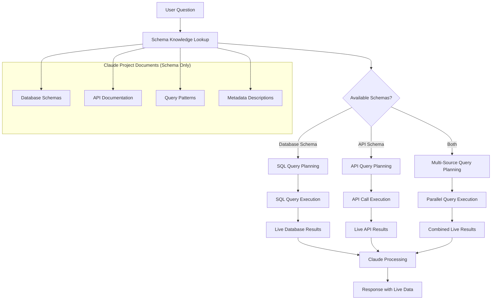
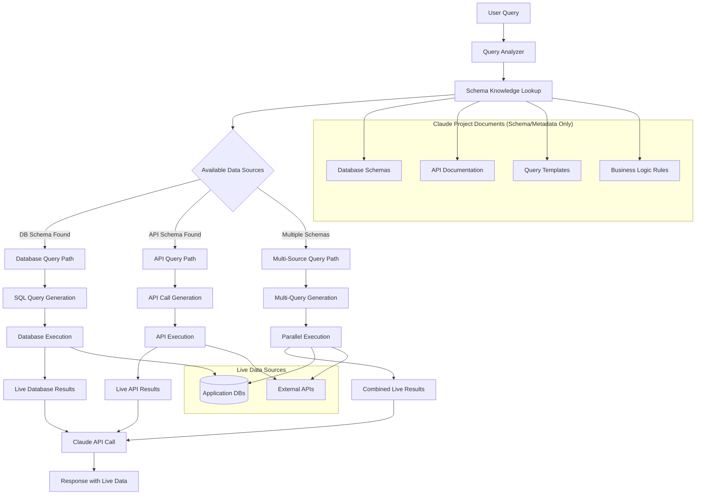
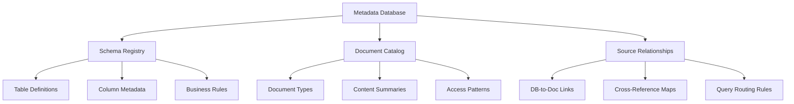
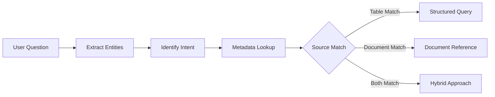
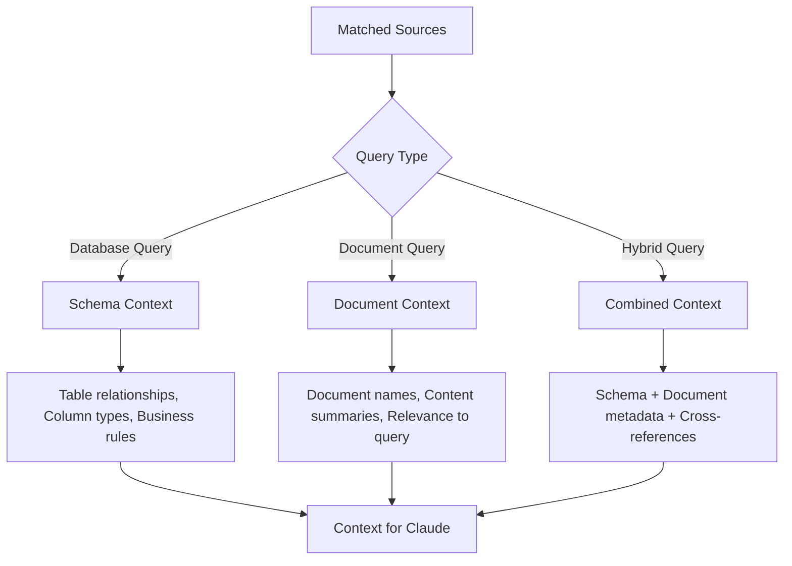
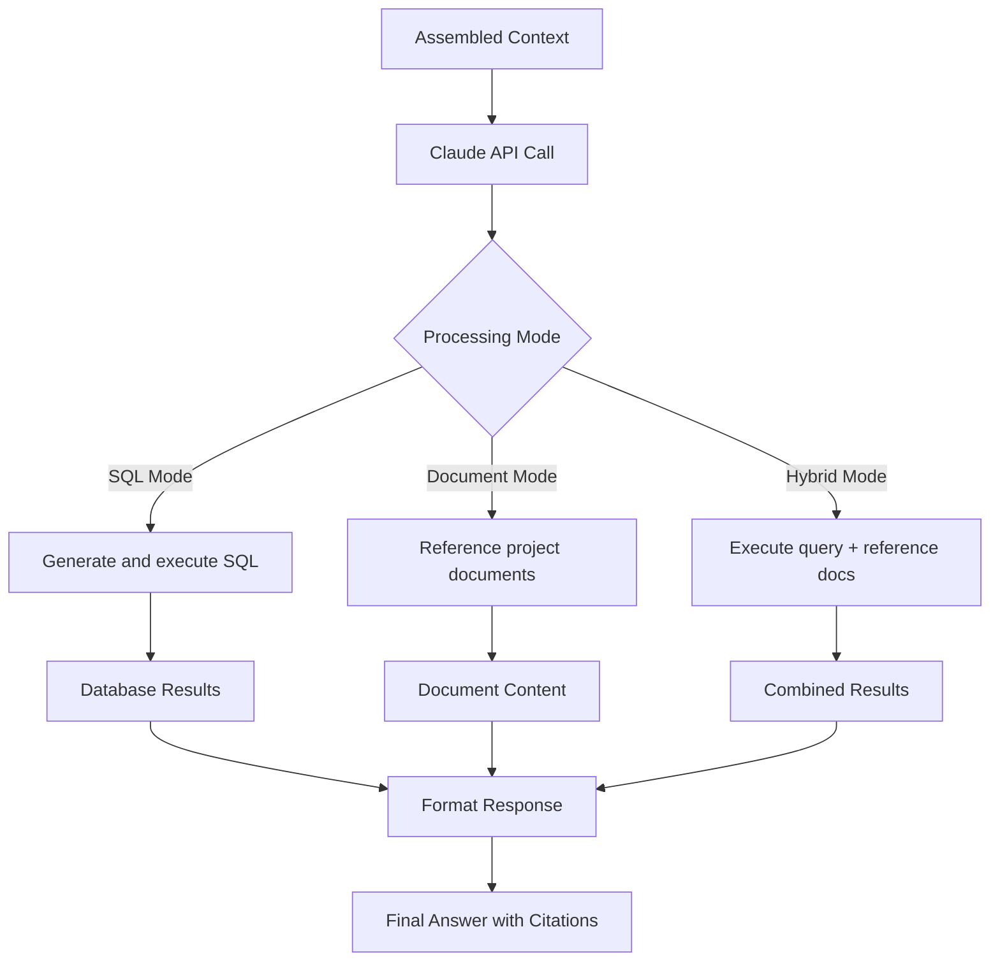

# Unified Claude Architecture for Data and Document Querying

## Key Abbreviations
- **API**: Application Programming Interface
- **SQL**: Structured Query Language
- **Claude Project Docs**: Native document upload to Claude (not a vector database)

## Core Unified Workflow



---

## Document vs Data Clarification

### Claude Project Documents (Schema/Metadata Only)
- **Contains**: Database schemas, metadata descriptions, query patterns
- **Does NOT Contain**: Actual customer data, order records, etc.
- **Purpose**: Helps Claude understand what data exists and how to query it
- **Examples**: `customer_db_schema.md`, `order_system_metadata.json`

### Actual Data (Retrieved via Queries)
- **Source**: Live databases (DynamoDB, MongoDB, RDS, etc.)
- **Access**: Claude generates and executes queries based on schema knowledge
- **Real-time**: Always current data, not static documents
- **Examples**: Actual customer records, current order status, live metrics

**Our Approach**: Claude Project Documents contain the "map" (schemas/metadata), queries retrieve the "treasure" (actual data).

---

## Single Architecture Implementation

**Use Case**: One system handles all data and document queries using metadata intelligence



---

## Metadata Database Structure

**Purpose**: Single source of truth for all available data and document sources



**Sample Metadata Structure**:
- **Tables**: `customers`, `orders`, `products` (with full schema)
- **Documents**: `customer_policies.pdf`, `order_procedures.doc` (with summaries)
- **Relationships**: Customer questions → check both `customers` table AND `customer_policies.pdf`

---

## Query Processing Flow

### Step 1: Question Analysis


### Step 2: Context Assembly Based on Metadata


### Step 3: Single Claude Call with Smart Context


---

## Example Metadata Entries

### Database Schema Entry
```json
{
  "source_type": "database",
  "source_id": "customer_db",
  "tables": {
    "customers": {
      "columns": ["id", "name", "email", "created_date"],
      "business_context": "Customer master data",
      "relationships": ["orders.customer_id"]
    }
  },
  "query_patterns": [
    "customer information",
    "customer details", 
    "account data"
  ]
}
```

### Document Catalog Entry
```json
{
  "source_type": "document",
  "source_id": "customer_handbook",
  "content_summary": "Customer service policies and procedures",
  "document_type": "policy",
  "topics": ["customer service", "support procedures", "escalation"],
  "related_entities": ["customers", "support_tickets"]
}
```

### Cross-Reference Entry
```json
{
  "query_pattern": "customer support process",
  "sources": [
    {"type": "database", "tables": ["customers", "support_tickets"]},
    {"type": "document", "files": ["customer_handbook.pdf", "support_procedures.doc"]}
  ],
  "strategy": "combine_structured_and_policy_data"
}
```

---

## Implementation Benefits

### Single Point of Intelligence
- One Claude instance handles all query types
- Unified response format regardless of source
- Consistent citation and reference handling

### Metadata-Driven Routing
- No hardcoded query logic
- Easy to add new data sources
- Self-documenting system through metadata

### Adaptive Query Strategy
- Automatically chooses best approach based on available sources
- Falls back gracefully when sources unavailable
- Learns from query patterns over time

---

## Query Examples

**Question**: "What's our top customer's support history?"

**Schema Knowledge Lookup**: 
- References `customer_db_schema.md` (uploaded to Claude project)
- References `support_system_api.md` (uploaded to Claude project)
- Finds schema for `customers` table and `support_tickets` API

**Query Generation**:
```
Schema Knowledge: customers(id, name, revenue), support_tickets API(customer_id, issue, status)
Business Rules: "Top customer" = highest revenue in current year
Query Plan: 1) SQL to find highest revenue customer, 2) API call for their support tickets
```

**Live Data Retrieval**: 
1. Executes SQL query against live customer database
2. Makes API call to support system with customer ID
3. Gets actual current data (not cached/static information)

**Claude Processing**: 
1. Combines live customer data with live support ticket data
2. References schema documentation for context and business rules
3. Provides comprehensive answer with current, real data

---

## Architecture Advantages

| Aspect | Benefit |
|--------|---------|
| **Simplicity** | Single workflow handles all query types |
| **Intelligence** | Metadata drives smart source selection |
| **Flexibility** | Easy to add new databases or documents |
| **Consistency** | Uniform response format and citations |
| **Efficiency** | One Claude call per query regardless of complexity |
| **Maintenance** | Centralized metadata makes system self-documenting |