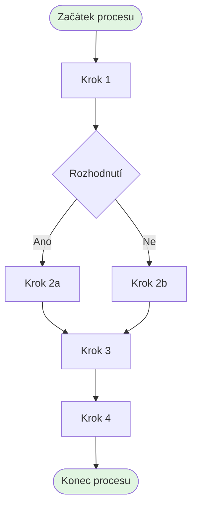

# {Název projektu}

```yaml
Name: {Název projektu}
id: {UUID - vygenerovat pomocí uuidgen}
Authors:
- {Jméno autora}
- {Jméno spoluautora}
Updated: {YYYY-MM-DDTHH:MM:SSZ}
Master: mkdocs
Contributors:
- {Oddělení/osoba}
- {Oddělení/osoba}
Language: cs
Annotation: {Stručný popis projektu v 2-3 větách. Co projekt řeší, jaký je jeho hlavní cíl a přínos pro společnost BRAINMARKET.}
Purpose:
- {Hlavní účel projektu}
- {Sekundární účel}
- {Další účel}
Start: {YYYY-MM-DD}
End: {YYYY-MM-DD}
Implementation: {počet} hodin
Priority: {vysoká|střední|nízká}
Status: {draft|probíhá|dokončen}
Metrics:
- {Kvantifikovatelná metrika úspěšnosti}
- {Další metrika s konkrétní hodnotou}
- {Návratnost investice}
```

## Východiska

### Kontext projektu

{Popis kontextu, ve kterém projekt vzniká. Jaká je současná situace ve společnosti, jaké trendy nebo požadavky projekt adresuje. 1-2 odstavce.}

### Identifikované potřeby

- {Konkrétní potřeba nebo problém #1}
- {Konkrétní potřeba nebo problém #2}
- {Konkrétní potřeba nebo problém #3}
- {Další identifikované potřeby}

### Technologické předpoklady

- {Dostupné technologie nebo systémy}
- {Požadované technické znalosti nebo infrastruktura}
- {Integrace s existujícími systémy}
- {Technická omezení nebo požadavky}

## Autoritativní normy a datové zdroje

### Legislativní požadavky
- **{Název předpisu}** - {stručný popis relevance}
- **{EU nařízení/směrnice}** - {oblast úpravy}
- **{České zákony/vyhlášky}** - {specifické požadavky}
- **{Normy ISO/ČSN}** - {pokud jsou relevantní}

### Interní datové zdroje
- {Databáze nebo systém s daty}
- {Dokumentace nebo archiv}
- {Existující procesy nebo metodiky}
- {Historická data nebo statistiky}

### Externí zdroje
- {Externí databáze nebo API}
- {Odborná literatura nebo studie}
- {Best practices v oboru}
- {Technologické platformy nebo služby}

## Flow chart projektu

### Současný stav
{Popis současného procesu nebo stavu, který projekt mění}

### Nový stav
{Popis cílového stavu po implementaci projektu}



## Metriky úspěšnosti

### Kvantitativní ukazatele
- **{Název metriky}**: {současná hodnota} → {cílová hodnota}
- **{Časová úspora}**: snížení z {X} hodin na {Y} hodin
- **{Finanční úspora}**: {částka} Kč ročně
- **{Zvýšení efektivity}**: {procento} %
- **{Snížení chybovosti}**: z {X} % na {Y} %

### Kvalitativní ukazatele
- {Zlepšení spokojenosti zaměstnanců/zákazníků}
- {Zvýšení kvality výstupů}
- {Zlepšení firemní kultury}
- {Posílení konkurenceschopnosti}
- {Soulad s firemními hodnotami}

## Zajištění realizace

### Interní podpora

#### Lidské zdroje
- **{Role}** - {popis činnosti} ({počet} hodin)
- **{Role}** - {popis činnosti} ({počet} hodin)
- **{Oddělení}** - {typ podpory} ({počet} hodin)

#### Technická infrastruktura
- {Existující systémy nebo nástroje}
- {Serverové nebo cloudové prostředí}
- {Komunikační kanály}
- {Zálohovací řešení}

### Externí zdroje

#### Konzultační služby
- **{Typ konzultanta}** - {oblast expertízy} ({počet} hodin)
- **{Externí dodavatel}** - {poskytované služby}

#### Technické komponenty
- {Licence nebo předplatné služeb}
- {Hardware nebo software}
- {Cloudové služby nebo API}

#### Finanční zajištění
- Jednorázová investice: {částka} Kč
- Měsíční/roční provozní náklady: {částka} Kč
- Návratnost investice: {počet} měsíců

## Závěr

{Shrnutí projektu, jeho klíčových přínosů a významu pro společnost BRAINMARKET. Zdůraznění hlavních benefitů a dlouhodobého dopadu. 1-2 odstavce.}

---

*Dokument vytvořen: {datum}*  
*Poslední aktualizace: {datum}*