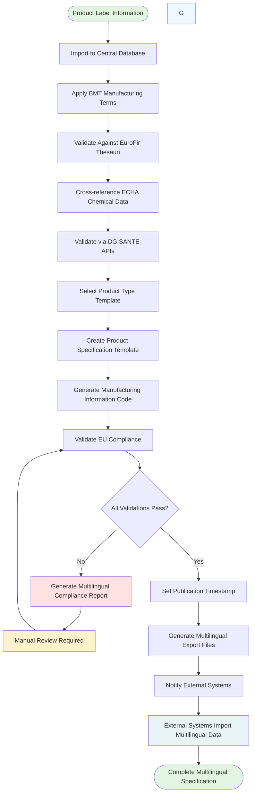

```yaml
Name: Centralized Product Data Management and Specification System
id: f92b4e90-9c86-45f3-b20b-0006095b8b1c
Authors:
- Jiří Hylmar
Updated: 2025-07-29T10:00:00Z
Master: mkdocs
Contributors:
- IT Department
- Manufacturing
- Expansions
- Project management
Language: en
Annotation: Project creates an authoritative centralized database system integrating EU approved dictionaries (EuroFir, ECHA, DG SANTE) with proprietary BRAINMARKET manufacturing terminology to generate multiple standardized multilingual product specification templates for different products and use cases. System designed for future scalability to all EU languages. Translations is a major challenge. Currently, only product labels serve as valid information source. External systems will import data from this new authoritative source.
Purpose:
- Create authoritative product specification database using EU-approved data sources and proprietary BRAINMARKET terminology
- Generate multiple standardized "Product Specification Template" formats for different products and use cases (food, proteins, powders, German product registration, etc.) with multilingual support
- Establish ground truth database integrating external EU standards with internal manufacturing terms
- Provide multilingual data export capabilities for EU market compliance
- Ensure seamless translation between English and EU languages
- Maintain proprietary BRAINMARKET Manufacturing Terminology (BMT) dictionaries
Start: 2025-08-01
End: 2025-12-31
Implementation: 720 hours (Claude estimate)
Priority: high
Status: draft
Metrics:
- Create authoritative database covering 100% of product portfolio in EU languages
- Generate complete multilingual specifications automatically
- Achieve 100% compliance with EU regulations using official data sources
- Maintain 100% consistency in BRAINMARKET proprietary terminology across all languages
- Provide standardized multilingual data exports for external system consumption
```

# Centralized Product Data Management and Specification System

## Project Background

### Project Context

BRAINMARKET currently has no method for keeping concise terminology when generating product specifications and descriptions. Information is entered and edited by different users in different systems without coordination, and systems are not ready to propagate changes throughout. The only valid source of product information exists on product labels, which is insufficient for comprehensive regulatory compliance and professional product management across EU markets requiring multiple languages. Verification and continuous improvement of translations is a major challenge. This project will create an authoritative centralized database that becomes the single source of truth, integrating EU-approved dictionaries with proprietary BRAINMARKET Manufacturing Terminology (BMT), with external systems instructed to import multilingual data from this new system.

### Identified Needs

- Creation of authoritative ground truth database integrating EU standards with proprietary BRAINMARKET terminology
- **Critical**: Seamless translation and terminology consistency across all EU languages (initially English, Czech, German with future expansion to all 24 official EU languages)
- Implementation of both EU-approved dictionaries and proprietary BMT Manufacturing Terms
- Generation of multiple "Product Specification Template" formats for different products and use cases:
  - Food products (supplements, organic foods)
  - Protein supplements (powders, bars, drinks)
  - Powder supplements (various formulations)
  - German product registration compliance
  - Future regulatory requirements for other EU markets
- Template-based specification management with configurable options for different product types and regulatory requirements
- Standardized multilingual data export capabilities for external system consumption
- Automated compliance validation against EU regulations in multiple languages
- Professional multilingual product documentation replacing label-only approach

### Technology Prerequisites

- Integration with EU-approved data sources: EuroFir, ECHA, and DG SANTE APIs
- Implementation of proprietary BRAINMARKET Manufacturing Terminology (BMT) database
- Multilingual database system supporting structured product specification generation across all EU languages
- Advanced template engine with configurable options for multiple product types and regulatory use cases
- Translation management system ensuring terminology consistency with scalability to all 24 official EU languages
- Data export APIs providing multilingual data for external systems
- Automated validation against multiple EU regulatory databases
- Support for multiple producers and regulatory frameworks across EU member states

## Authoritative Standards and Data Sources

### EuroFir Food Composition Data

Use of special standardised controlled vocabularies (thesauri) for food composition data (FCD) description is one of the key elements of harmonised and standardised EuroFIR specifications for FCD processing. The specifications are based on a relational database model containing four main and other additional entities. 

- **Primary Source**: [EuroFir Thesauri](https://www.eurofir.org/our-resources/eurofir-thesauri/) - Standardized controlled vocabularies for food composition data
- **Czech Implementation**: [Databáze složení potravin ČR](https://www.nutridatabaze.cz/eurofir/) - Guaranteed by Ústav zemědělské ekonomiky a informací
- **Technical Implementation**: Already parsed to AWS S3, Athena - [GitHub Repository](https://github.com/DigitalHorizonCz/app-eurofir-thesauri)
- **Usage**: Foundation for all food composition terminology and nutritional data standardization

### ECHA Chemical Substances Database

- **Agency**: [European Chemicals Agency (ECHA)](https://www.echa.europa.eu/about-us)
- **Primary Database**: [ECHA CHEM](https://chem.echa.europa.eu/) - Consolidated source with information from all REACH registrations
- **IUCLID Tool**: [IUCLID6](https://iuclid6.echa.europa.eu/) - Essential tool for recording, storing, and exchanging chemical data
- **Reference Substances**: [IUCLID Reference Substances](https://iuclid6.echa.europa.eu/get-reference-substances) - CAS and EC numbers database
- **Technical Implementation**: [Tested locally](https://github.com/DigitalHorizonCz/app-brm-iuclid) with 3,776 reference substances successfully queried
- **Usage**: Authoritative source for chemical substance identification, CAS numbers, and regulatory data

#### Notes on ECHA

Operating EC Inventory (former), https://www.echa.europa.eu/information-on-chemicals/ec-inventory

Currently beining updated https://echa.europa.eu/en/echa-chem to the consoliadted source. This is ECHA’s new public chemicals database with information from all REACH registrations received by the Agency **https://chem.echa.europa.eu/**.

- Can I export the full C&L inventory? [May 2025]: The initial release of the ECHA CHEM C&L Inventory will be data complete; additional features will continue to be developed. In the initial version it will not be possible to download the full C&L Inventory (https://echa.europa.eu/documents/10162/77244094/echa-chem_faq_en.pdf/84056036-acde-71a2-777e-3348c22f40c5?t=1712731492667).

The tool created by ECHA.

https://iuclid6.echa.europa.eu/

IUCLID plays a central role in the IT environments of all organisations that manage scientific data on chemicals in a regulatory context, for example under the OECD HPV, EU Biocides, and EU REACH:
- Industry stakeholders
- EU Member States
- The European Chemicals Agency (ECHA)
IUCLID is the essential tool for any organisation or individual that needs to record, store, submit, and exchange data on chemical substances in the format of the OECD Harmonised Templates.

*Its local or server DB. There are data on reference substances, includint CAS a EC NUMBERS. These are what we need.* **https://iuclid6.echa.europa.eu/get-reference-substances**.

- DB needs to run local or server
- Import of *Reference substances* dataset into the DB has to be made
- With API local exports can be created `./app-brm-iuclid/data/iuclid_reference_substance/REFERENCE_SUBSTANCE.csv`
- These can be uploaded to our DB.

- **Tested locally https://github.com/DigitalHorizonCz/app-brm-iuclid**
- **3776 results found**

```bash
hylmarj@jirih-hp-zbook-14u-g6:~/app-brm-iuclid$ bash test-query.sh 
Testing connection to IUCLID6...
✓ Connected to IUCLID6 version 9.0.3

Query 1: Counting total reference substances...
Total Reference Substances: 3776

Query 2: Retrieving first 10 reference substances...
First 10 substances:
  • triphenylarsine
  • triphenylene
  • ethylcyclohexane
  • atropine
  • levomepromazine
  • S-benzyl diisopropyl phosphorothioate
  • myrtecaine
  • phenacetin
  • oleoylanilide
  • fentiazac

Query 3: Searching for substances containing 'water'...
Found 1 substances containing 'water':
  • water

Test queries completed!
```

### Directorate-General for Health & Food Safety *DG SANTE*

DG SANTE Food Safety APIs

- **Authority**: Directorate-General for Health & Food Safety
- **API Portal**: [DG SANTE Developer APIs](https://developer.datalake.sante.service.ec.europa.eu/apis)
- **Key APIs for Implementation**:
  - **[Food Additives API](https://developer.datalake.sante.service.ec.europa.eu/api-details#api=228d6fda-9092-4c25-af9a-d537666ed0e5)** - Approved food additives and conditions of use (Regulation EC 1333/2008)
  - **[Food Flavourings API](https://developer.datalake.sante.service.ec.europa.eu/api-details#api=0b718144-4dfa-4623-83d1-ab08926da575)** - Approved flavouring substances (Regulation EC 1334/2008)
  - **[Health Claims API](https://developer.datalake.sante.service.ec.europa.eu/api-details#api=3b2e2a29-bc7c-4eab-9f29-1473fde20d8a)** - Authorized health claims database
  - **[Novel Food Catalog API](https://developer.datalake.sante.service.ec.europa.eu/api-details#api=a38210a6-5759-4838-a021-aa616abfc01f)** - Authorized novel foods with conditions and specifications
  - **[Pesticides API](https://developer.datalake.sante.service.ec.europa.eu/api-details#api=daebcf50-ecd2-4ab8-8cd4-e002373aff4c)** - Active substances and Maximum Residue Levels (MRLs)
  - **[Feed Additives API](https://developer.datalake.sante.service.ec.europa.eu/api-details#api=b776e308-0eef-43da-8e83-674b7fbab318)** - EU Register of Feed Additives

#### Notes on SANTE APIs

Food and Feed Information Portal Database https://ec.europa.eu/food/food-feed-portal/screen/home.

Following APIs are available at: [https://developer.datalake.sante.service.ec.europa.eu/apis](https://developer.datalake.sante.service.ec.europa.eu/apis)

| Name | Description |
|------|-------------|
| [**API - EUPVP - Catalog**](https://developer.datalake.sante.service.ec.europa.eu/api-details#api=556bed54-b347-4adc-810e-3973b49739a3&operation=941dd838-4330-4a7e-aff8-49d228e41853) | This dataset lists varieties of agricultural plant and vegetable species. Seeds and plant reproductive material of registered varieties listed in this dataset can be marketed throughout the EU. |
| [**API - EUPVP - Forematis**](https://developer.datalake.sante.service.ec.europa.eu/api-details#api=e78f53b5-5c69-4fda-bb41-86e2f591860b&operation=a1230175-110f-4e92-bfa4-afd7e8a20c6e) | New Formatis dataset version based on Synapse Pipeline |
| [**API - Food additives**](https://developer.datalake.sante.service.ec.europa.eu/api-details#api=228d6fda-9092-4c25-af9a-d537666ed0e5&operation=ea5e05d1-f567-4ed2-a316-b9466fd2f6e6) | This database is a searchable tool informing about the food additives approved for use in food in the EU and their conditions of use. It is based on the Union list of approved food additives laid down in Annex II to Regulation (EC) No 1333/2008. |
| [**API - EUPVP - Frumatis**](https://developer.datalake.sante.service.ec.europa.eu/api-details#api=bc5fb820-0e47-49ee-9bd9-a922dbcec9a7&operation=b334cf90-10b3-4d0f-82ac-fb56d9e756e7) | New Frumatis APIs based on Azure Synapse |
| [**API - Files**](https://developer.datalake.sante.service.ec.europa.eu/api-details#api=api-SANTE-files-v1-0&operation=files-download) | This API allows users to download publicly available files. |
| [**API - Food and Feed Alert Notifications**](https://developer.datalake.sante.service.ec.europa.eu/api-details#api=c5ad39eb-712e-4cb4-a7f6-764de863ae7e&operation=cc6aab62-bd15-4904-b20d-54551ccb9468) | This API offers features to retrieve public and summary information regarding the latest RASFF notifications |
| [**API - Food Flavourings**](https://developer.datalake.sante.service.ec.europa.eu/api-details#api=0b718144-4dfa-4623-83d1-ab08926da575&operation=86a39c15-7bed-4501-b9b6-637d8dc52f50) | This database is a searchable tool informing about the flavouring substances approved for use in food in the EU and their conditions of use. It is based on the Union list of approved flavourings and source materials laid down in Annex I to Regulation (EC) No 1334/2008. |
| [**API - Feed Additives**](https://developer.datalake.sante.service.ec.europa.eu/api-details#api=b776e308-0eef-43da-8e83-674b7fbab318&operation=923bb492-0662-433a-8547-762b7757cfcb) | The Commission has established the European Union Register of Feed Additives, which is regularly updated, and it makes reference/links to the relevant authorisation Regulations. Those Regulations include the specific requirements for placing the additives on the EU and EEA market. |
| [**API - Novel Food Catalog**](https://developer.datalake.sante.service.ec.europa.eu/api-details#api=a38210a6-5759-4838-a021-aa616abfc01f&operation=2fceb7fd-23e0-40d0-938d-2de7e2b0455d) | The Implementing Regulation establishing the list of novel foods compiles all the authorised novel foods in the European Union to date. It includes their conditions of use, labelling requirements, and their specifications. |
| [**API - Genetically Modified Organisms**](https://developer.datalake.sante.service.ec.europa.eu/api-details#api=84aa8b82-caa6-4b66-ae88-c8bc08b82796&operation=51ee1621-5742-433f-a3db-d8f4506d9f5a) | These search engines cover the Community register of GM food and feed (Regulation (EC) 1829/2003), the pending, withdrawn and expired GM products (Regulation (EU) 619/2011) and GMOs authorised under Directive 2001/18/EC. |
| [**API - Health Claims**](https://developer.datalake.sante.service.ec.europa.eu/api-details#api=3b2e2a29-bc7c-4eab-9f29-1473fde20d8a&operation=fe5575e7-3aad-4cec-a197-a050240b2378) | The search tool only allows searches for health claims, and not nutrition claims. |
| [**API - Pesticides**](https://developer.datalake.sante.service.ec.europa.eu/api-details#api=daebcf50-ecd2-4ab8-8cd4-e002373aff4c&operation=c4804d5d-3267-4d73-b677-c3a2b510e5bc) | The EU Pesticides Database allows users to search for information on active substances used in plant protection products, Maximum Residue Levels (MRLs) in food products, and emergency authorizations of plant protection products in Member States |
| [**API - Smoke Flavourings**](https://developer.datalake.sante.service.ec.europa.eu/api-details#api=3061dec3-0ad2-44a2-831e-2869b6015f99&operation=12b7979e-ad43-4fa5-963d-939006f57df7) | This database is a searchable tool informing about the smoke flavouring products approved for use in the EU and their conditions of use. It is based on the Union list of authorised smoke flavouring primary products for use as such in or on foods and/or for the production of derived smoke flavouring laid down in Annex to Regulation (EC) No 1321/2013. |

### Proprietary BRAINMARKET Manufacturing Terminology (BMT)

#### BMT Manufacturing Terms Database

- **Core Database**: BRAINMARKET Manufacturing Information Code (BMT) terms with unique descriptor IDs
- **Current Status**: 67 manufacturing terms active as of 2025-07-22T12:42:03.861231
- **Structure**: Hierarchical terminology covering complete product specification lifecycle
- **Key Categories**:
  - **Information Identification**: Manufacturing codes, timestamps, authorship
  - **Product Identification**: Names, descriptions, EAN codes, certifications
  - **Composition and Allergens**: Ingredients lists, allergen information
  - **Nutritional Value**: Energy, macronutrients, vitamins, minerals
  - **Organoleptic Characteristics**: Consistency, color, flavor, odour
  - **Physical and Chemical Parameters**: Compliance statements, chemical residues
  - **Microbiological Criteria**: CPM, yeasts, molds, pathogens
  - **Storage and Shelflife**: Conditions, shelf life, product weight
  - **Packaging**: Types, regulatory compliance
  - **Producer and Validity**: Producer information, signatures, validity dates

#### BMT Values Terms Database

- **Core Database**: BRAINMARKET Value Code (BMT_VAL) terms with unique descriptor IDs
- **Current Status**: 30 value terms active as of 2025-07-22T12:42:07.520828
- **Structure**: Standardized values for authorship, templates, legislation, product details
- **Key Categories**:
  - **Authorship**: Jiří Hylmar, Tereza Sýkorová, Jana Tomečková
  - **Templates**: Multiple Product Specification Templates:
    - Product Specification Template Supplements Food
    - Product Specification Template Supplements Proteins
    - Product Specification Template Supplements Powders
    - Future templates for German product registration and other EU regulatory requirements
  - **Legislation Detail**: EU regulation compliance statements
  - **Product Detail**: Organic certification, GMO statements, radiation treatment
  - **Nutritional Detail**: Standardized nutritional value expressions

#### Template Configuration System

- **Product Type Support**: powder supplement | protein supplement | food | German registration | [future EU regulatory templates]
- **Multiple Template Types**: Dynamic specification generation supporting various product categories and regulatory requirements
- **Usage Mapping**: Each BMT term mapped to applicable product types and regulatory use cases
- **EU-Wide Language Support**: Complete translation framework supporting initial English, Czech, German with architecture for all 24 official EU languages
- **Regulatory Adaptability**: Template system designed to accommodate country-specific requirements (German product registration, French ANSES submissions, etc.)

## Legislative Compliance Framework
- **Regulation (EC) No. 2023/915** - contaminants in food products
- **Regulation (EC) No. 396/2005** - maximum residue levels of pesticides  
- **Regulation (EC) No. 2073/2005** - microbiological criteria for foodstuffs
- **Regulation (EC) No. 1170/2009** - food labeling requirements
- **Regulation (EC) No. 1333/2008** - food additives (via DG SANTE API)
- **Regulation (EC) No. 1334/2008** - flavourings (via DG SANTE API)
- **Regulation (EC) No. 1935/2004/EC** - materials in contact with food
- **CZ-BIO-001** - Czech organic certification standards

## Internal Data Sources
- Current product labels (only existing valid source)
- Existing certifications (CZ-BIO-001, Organic)
- Manufacturing data from Votamax s.r.o. and BrainMarket GmbH
- Product identification codes and EAN numbers
- BMT proprietary terminology database (last updated 2025-07-22)

## Project Flow Chart

### Current State

Only product labels contain valid product information. No centralized database, standardized specifications, or multilingual terminology management exists. External systems maintain separate, uncoordinated data stores.

### Target State

Authoritative centralized database integrating EU-approved sources with proprietary BMT terminology generates comprehensive multilingual specifications. Template-based specification generation with external systems importing multilingual data from single source of truth.



## Success Metrics

### Quantitative Indicators

- **EU-Wide Multilingual Database Authority**: Create single source of truth for 100% of product portfolio with initial support for English, Czech, German and architecture for all 24 official EU languages
- **BMT Integration**: 100% utilization of proprietary BRAINMARKET Manufacturing Terminology (67 manufacturing terms + 30 value terms)
- **Multi-Template Coverage**: Support for all product types and regulatory use cases (powder supplement, protein supplement, food, German registration, future EU regulatory templates)
- **Specification Generation**: 0% automated → 100% automated multilingual specifications across multiple template types
- **EU Data Source Integration**: 0% → 100% using EuroFir, ECHA, and DG SANTE APIs
- **Translation Consistency**: 100% terminology consistency across all supported languages with scalability framework
- **Regulatory Compliance**: Current gaps → 100% validated against official EU databases across multiple regulatory frameworks

### Qualitative Indicators

- Establishment of BRAINMARKET as authoritative EU-wide multilingual source for product data
- Seamless EU market expansion through consistent multilingual terminology across all member states
- Professional multilingual product documentation suitable for regulatory submissions across entire EU
- Enhanced confidence in regulatory compliance through official EU data sources and BMT integration
- Simplified multilingual data management for external systems through standardized imports
- Foundation for future product development and regulatory expansion across all EU markets
- Scalable architecture supporting rapid expansion to additional EU languages and regulatory frameworks

## Implementation Resources

### Internal Support (Claude estimate)

#### Human Resources

- **Database Architect** - Central system design, EU API integration, and BMT database implementation (180 hours)
- **Backend Developer** - Database implementation, multilingual support, and export API development (200 hours)
- **EU Data Integration Specialist** - EuroFir, ECHA, DG SANTE API implementation (160 hours)
- **Translation/Terminology Manager** - BMT terminology maintenance and multilingual consistency (100 hours)
- **Product Specification Expert** - Template definition and validation for multiple product types (90 hours)
- **Compliance Officer** - EU regulation validation and testing across languages (70 hours)
- **Quality Assurance** - System testing and multilingual specification accuracy validation (60 hours)

#### Technical Infrastructure

- Central authoritative multilingual database system
- EU API integration layer (EuroFir, ECHA, DG SANTE)
- IUCLID6 local installation for ECHA reference substances
- BMT proprietary terminology database with translation management
- Template engine supporting configurable product type specifications
- Automated multilingual specification generation engine
- Multilingual data export APIs for external system consumption
- Compliance validation and monitoring systems across multiple languages

### External Resources (Claude estimate)

#### Consulting Services
- **EU Food Regulation Expert** - DG SANTE API implementation guidance and multilingual compliance (60 hours)
- **Chemical Database Specialist** - ECHA IUCLID optimization (40 hours)
- **Multilingual Database Expert** - Translation management and terminology consistency (48 hours)
- **Database Performance Expert** - Scalability and optimization for multilingual data (32 hours)

#### Technical Components and Licensing
- **IUCLID6 Local Installation** - ECHA reference substances database: €2,500/year
- **EU API Access Costs** - DG SANTE developer access: €1,200/year
- **Translation Management Platform** - Professional terminology management: €2,400/year
- **Cloud Database Infrastructure** - High-availability multilingual system: €1,500/month
- **Integration Platform Services** - API management and monitoring: €800/month
- **Backup and Compliance Monitoring** - Data integrity and audit trails: €500/month

#### Financial Requirements
- One-time development investment: €78,000
- Annual operational costs: €39,300
- Estimated operational efficiency value: €65,000/year
- Return on investment: 14 months

## Conclusion

The Centralized Product Data Management and Specification System will establish BRAINMARKET as the authoritative EU-wide multilingual source for product information by integrating official EU databases (EuroFir, ECHA, DG SANTE) with proprietary BRAINMARKET Manufacturing Terminology (BMT). This system transforms the current label-only approach into a comprehensive, professionally validated multilingual database that generates multiple types of product specifications compliant with all relevant EU regulations. The advanced template-based specification system supports multiple product types and regulatory use cases while ensuring terminology consistency across initially three languages with architecture designed for all 24 official EU languages. External systems will benefit from importing standardized, authoritative multilingual data rather than maintaining separate, potentially inconsistent databases. The project foundation on both official EU data sources and proprietary BMT terminology, combined with scalable multilingual architecture, ensures long-term regulatory compliance and positions BRAINMARKET for seamless expansion across all European food supplement and organic product markets.

---

*Document created: 2025-07-29*  
*Last updated: 2025-07-29*