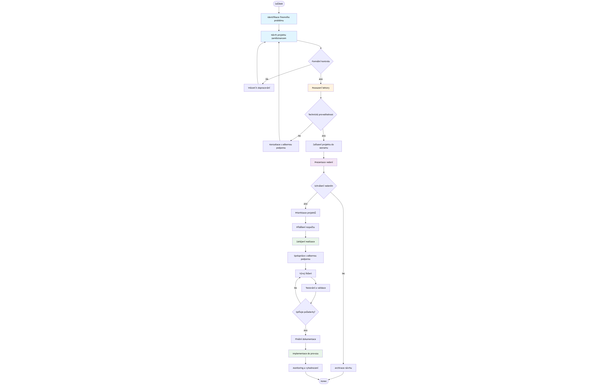

<!--
pandoc "/home/hylmarj/projects-digital-horizon/Projekty digitalizace BRAINMARKET/projekt.md" -o "/home/hylmarj/projects-digital-horizon/Projekty digitalizace BRAINMARKET/projekt.docx"
-->

# Projekty digitalizace BRAINMARKET

```yaml
Name: Projekty digitalizace BRAINMARKET
id: 469a487d-1503-47cf-a5fe-2228361f25bd
Authors:
- Jiří Hylmar
Updated: 2025-06-15T14:28:32Z
Master: mkdocs
Contributors:
- Lukáš Orčík
- Matěj Veselý
Language: cs
Annotation: Projekt představuje rámec pro systematické zavedení, schvalování a realizaci dílčích automatizačních projektů v rámci společnosti. Slouží jako metodický návod pro účastníky kurzu Digitalní Horizont k identifikaci, dokumentaci a implementaci digitálních řešení firemních problémů. Projekt definuje standardizovaný proces od iniciace návrhu přes schvalovací procedury až po finální technickou dokumentaci, zajišťující transparentnost, efektivitu a měřitelnost digitální transformace.
Purpose:
- Implementační plán automatizací BRAINMARKET
- Konsolidace dílčích projektů
- Vzor zpracování projektu
Start: 2025-06-13
End: 2025-08-30
Implementation: 80 hodin
Priority: vysoká
Status: probíhá
Metrics:
- 40 hodin ušetřeného času měsíčně
- návratnost 2 měsíce od dokončení projektu
```

## Východiska

### Kontext projektu

- **Kurz Digitalní Horizont**: Pětiměsíční vzdělávací program zaměřený na digitální transformaci
- **Časový rámec**: 2. polovina kurzu (měsíce 3-4)
- **Cílová skupina**: Zaměstnanci napříč organizačními úrovněmi

### Identifikované potřeby

1. **Standardizace procesů**: jednotný postup pro zadávání a schvalování projektů
2. **Dokumentační deficit**: strukturovaný způsob uchovávání projektové dokumentace
3. **Transparentnost**: viditelnost průběhu schvalování a realizace projektů
4. **Automatizace**: manuální procesy zpomalují implementaci inovací

### Technologické předpoklady

- GitHub pro verzování a správu dokumentace
- Docker pro kontejnerizaci řešení
- AWS Cloud Services pro škálovatelnou infrastrukturu
- Strukturované datové úložiště pro automatické načítání projektů

## Autoritativní normy a datové zdroje

### Legislativní požadavky
- **Zákon č. 121/2000 Sb.** - Autorský zákon
- **Nařízení (EU) 2016/679** - GDPR
- **ISO 27001** - Bezpečnost informací
- **ISO 9001** - Systém managementu kvality

### Interní normy
- Organizační řád společnosti
- Interní směrnice pro projektové řízení
- Pravidla pro schvalování investic
- IT Security Policy

### Datové zdroje
- GitHub repository pro verzování dokumentace
- Interní knowledge base
- Projektové šablony a best practices
- Databáze dodavatelů a technologií

## Flow chart projektu



## Struktura návrhu individuálního projektu

Záhlaví slouží ke generování pdf, word, etc.

Nadpis první úrovně a metadata. Každý projekt musí obsahovat pod nadpisem první úrovně metadata `YAML`. Jedná se o strukturované shrnutí projektu.

Použije se template 

Ukládání materiálů dílčích projektů

Adresářová struktura

```
hylmar-brain-digital-horizon/
├── PROJECTS/
│   └── Projekty digitalizace BRAINMARKET/
│       ├── projekt.md                 # Hlavní dokument projektu
│       ├── flow-chart-projektu.mmd    # Zdrojový kód pro flow chart
│       ├── flow-chart-projektu.png    # Obrázek flow chart
│       ├── podklady/                  # Podpůrné materiály
│       │   ├── analyza/               # Analytické dokumenty
│       │   ├── navrhy/                # Technické návrhy
│       │   └── prezentace/            # Prezentační materiály
│       ├── src/                       # Zdrojové kódy
│       │   ├── scripts/               # Automatizační skripty
│       │   └── configs/               # Konfigurační soubory
│       └── docs/                      # Technická dokumentace
│           ├── api/                   # API dokumentace
│           └── user-guide/            # Uživatelská příručka
```

## Metriky úspěšnosti

### Kvantitativní ukazatele
- **Počet podaných návrhů**: 
Cíl 10+ za kurz
- **Míra schválení**: Min. 40% návrhů
- **Doba implementace**: Průměrně do 3 měsíců
- **ROI projektů**: Návratnost do 12 měsíců

### Kvalitativní ukazatele

- Zvýšení digitální gramotnosti účastníků
- Zlepšení firemní kultury inovací
- Posílení mezioborové spolupráce
- Vytvoření knowledge base pro budoucí projekty

## Zajištění realizace

### Interní podpora

#### Lidské zdroje
- **Projektový manažer** - koordinace a řízení projektu (0,5 úvazku)
- **Metodický specialista** - návrh procesů a dokumentace (0,3 úvazku)
- **IT architekt** - technická koncepce a integrace (0,4 úvazku)
- **Kurátor kurzu** - pedagogická podpora (0,2 úvazku)
- **Účastníci kurzu** - realizátoři dílčích projektů (20 osob)

#### Technická infrastruktura
- GitHub pro verzování a správu dokumentace
- Docker pro kontejnerizaci řešení
- AWS Cloud Services pro hostování aplikací
- Firemní IT infrastruktura

### Externí zdroje

#### Konzultační služby
- **Lektoři kurzu Digitalní Horizont** - odborné konzultace
- **Externí IT konzultant** - architektura řešení (40 hodin)
- **Procesní konzultant** - optimalizace workflow (24 hodin)

#### Technické komponenty
- Licence pro GitHub Enterprise
- AWS kredity pro pilotní projekty
- Licence pro projektové nástroje

#### Finanční zajištění
- Rozpočet na realizaci: 300 000 Kč
- Roční provozní náklady: 120 000 Kč
- ROI: návratnost do 6 měsíců od implementace

## Závěr

Projekt Projekty digitalizace BRAINMARKET vytváří strukturovaný rámec pro digitální transformaci společnosti prostřednictvím systematického přístupu k identifikaci, schvalování a implementaci automatizačních projektů. Kombinací vzdělávání, praktické aplikace a kontinuální podpory umožňuje zaměstnancům aktivně utvářet digitální budoucnost firmy.

---

*Dokument je živý a bude průběžně aktualizován na základě zkušeností z realizace projektů.*